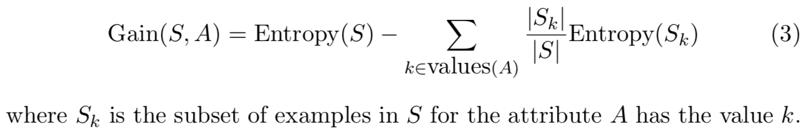
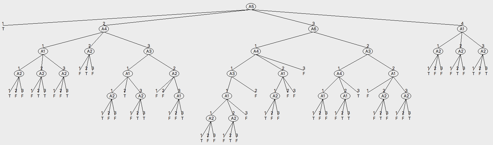
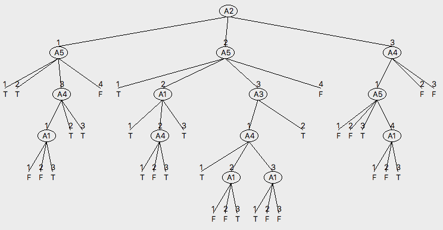
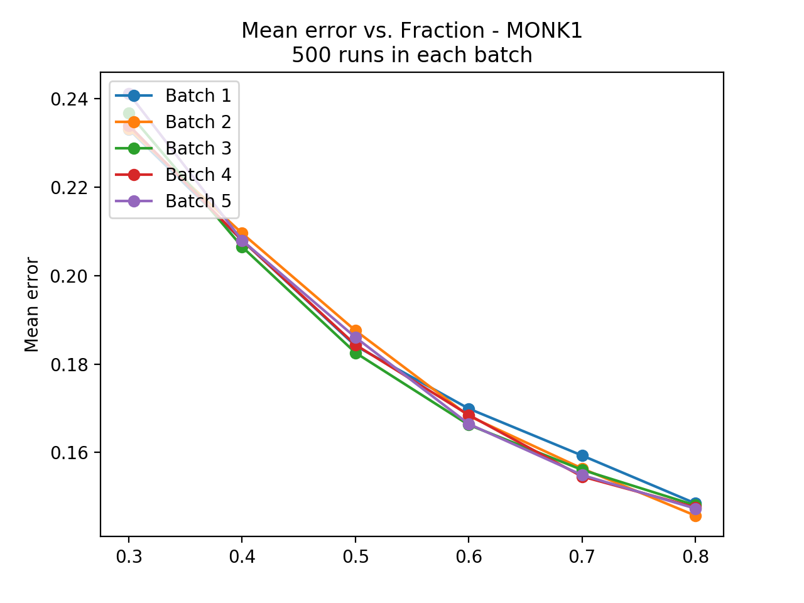
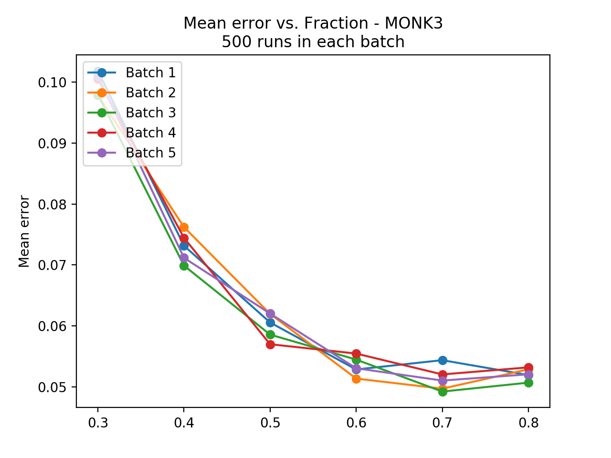
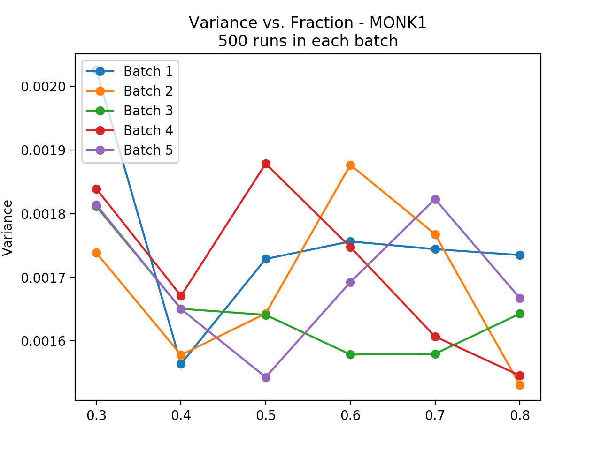
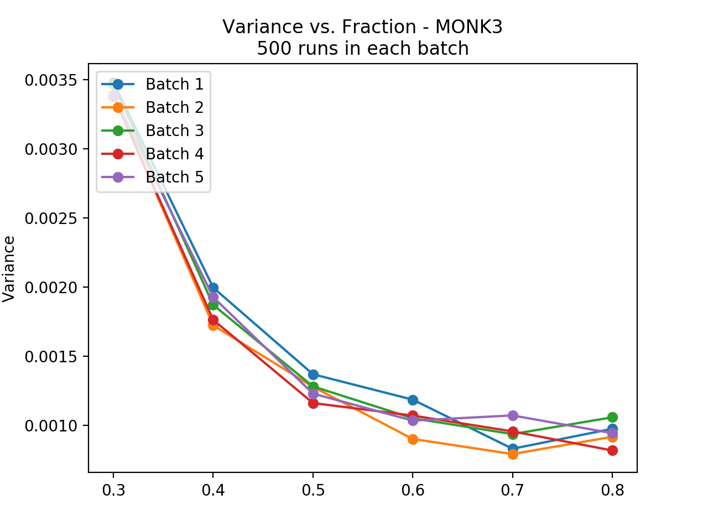

# LAB.1 - Decision Trees

**Authors:** Jonathan Rintala, Erik Skogetun

Answers for Laboration 1 in DD2421 Machine Learning at KTH.

------

## 2. MONK Datasets

#### Assignment 0:

> Each one of the datasets has properties which makes them hard to learn. Motivate which of the three problems is most difficult for a decision tree algorithm to learn.

- **MONK-1**: 
  - Logic: $(a1=a2)∨(a5=1) $
  - Motivation: This dataset contains both attribute a1 and a2 in the same relation, which means they will be difficult to split. Fairly few data points in training set (124). Only three attributes that influence the decision, which means only a depth of 3 should be required to decide all outcomes.
- **MONK-2:**
  - Logic: ${a_i} = 1 \space for\space exacly\space two\space i ∈ \{1,2,…,6\} $
  - Motivation: This dataset contains a relation between the value of two attributes, where one of the attributes is compared to the value of another. One can therefore not split only by looking at the value of one attribute. Since all attributes are independent, a depth of 6 is required. Therefore, this dataset is assumed to be the most difficult to learn.
- **MONK-3:**
  - Logic: $(a5 = 1∧a4 = 1)∨(a5 \neq 4∧a2 \neq 3)$
  - Motivation: This dataset contains noise according to the problem description that states the fact that the dataset has 5% additional noise in the training set. The training set also has the fewest number of data points (122), relative to the other two datasets. Since only three attributes influence the decision, a depth of 3 is enough to decide all outcomes.


## 3. Entropy

$Entropy(S) = −  \sum_{i}{p_i log_2 p_i } => \{binary \space classification\} \\=> Entropy(S) = -p_0log_2p_0 - p_1log_2p_1$

#### Assignment 1:

> The file dtree.py defines a function entropy which calculates the entropy of a dataset. Import this file along with the monks datasets and use it to calculate the entropy of the training datasets. 

Using the provided function for calculating entropy of dataset d: dtree.entropy(d)

Rounding to 4 significant figures.

| Dataset | Entropy |
| ------- | :------ |
| MONK-1  | 1.000   |
| MONK-2  | 0.9571  |
| MONK-3  | 0.9998  |

#### Assignment 2:

> Explain entropy for a uniform distribution and a non-uniform distribution, present some example distributions with high and low entropy. 

- **Uniform distribution:**
  Entropy will be maximized if p is uniform. This is because the pdf on a domain d = {x_1, x_2, …, x_n} with maximum entropy, corresponds to the least amount of knowledge about the domain d, which is the uniform distribution. Examples are:

  - Fair six sided die: $ent = -log(1/6) \approx 2.58 bits $
  - Fair coin: $ent = -[1/2*log(1/2) + 1/2*log(1/2)] = 1bit $

- **Non-uniform distribution:**

  The entropy for a non-uniform distribution will be lower than for the uniform one. This is because a non-uniform distribution is easier to predict and thus have a lower amount of uncertainty. For example:

  - Biased coin: $ent = -[3/4*log(3/4) + 1/4*log(1/4)] = 0.81bit < 1bit$


## 4. Information Gain

#### Assignment 3:

> Use the function averageGain (defined in dtree.py) to calculate the expected information gain corresponding to each of the six attributes. Note that the attributes are represented as instances of the class Attribute (defined in monkdata.py) which you can access via m.attributes[0], ..., m.attributes[5]. Based on the results, which attribute should be used for splitting the examples at the root node? 

Using the provided function for calculating information gain: dtree.averageGain(dataset,attribute) 

- Ex. for MONK-1: 

  `for i in range(6):` 

  `	print(round(dtree.averageGain(m.monk1, m.attributes[i]),5))`

Rounding to 5 decimals.

| Dataset | $a_1$   | $a_2$       | $a_3$   | $a_4$   | $a_5$       | $a_6$   |
| :------ | ------- | ----------- | ------- | ------- | ----------- | ------- |
| MONK-1  | 0.07527 | 0.00584     | 0.00471 | 0.02631 | **0.28703** | 0.00076 |
| MONK-2  | 0.00376 | 0.00246     | 0.00106 | 0.01566 | **0.01728** | 0.00625 |
| MONK-3  | 0.00712 | **0.29374** | 0.00083 | 0.00289 | 0.25591     | 0.00708 |

**Conclusion:** 

- For MONK-1 use $a_5$ with avg. information gain of 0.28703
- For MONK-2 use $a_5$ with avg. information gain of 0.01728
- For MONK-3 use $a_2$ with avg. information gain of 0.29374 


#### Assignment 4:

> For splitting we choose the attribute that maximizes the information gain, Eq.3. Looking at Eq.3 how does the entropy of the subsets, Sk, look like when the information gain is maximized? How can we motivate using the information gain as a heuristic for picking an attribute for splitting? Think about reduction in entropy after the split and what the entropy implies.



If we pick the attribute with the largest information gain, that means the uncertainty - the entropy, will be reduced the most by this attribute. This also means the attribute is more important than others in the decision making. 

When the information gain $Gain(S,A)$ is maximized, that means more information is acquired and thus the entropy of subset $S_k$ is decreasing.

If we use the information gain as a heuristic we want to maximize when making a split, that will ensure selecting an attribute to split on, which reduces the uncertainty (entropy) of the subsets $S_k$ the most. Followingly, this reduces the number of splits and subsets - i.e. results in the smallest tree with the most pure subsets, which increases the performance of the decision tree algorithm. An attribute with a high information gain, implies a branch which is more homogenous and predictable.


## 5. Building Decision Trees


#### Assignment 5:

> Build the full decision trees for all three Monk datasets using buildTree. Then, use the function check to measure the performance of the decision tree on both the training and test datasets. 
>
> For example to built a tree for monk1 and compute the performance on the test data you could use 
>
> ```
>    import monkdata as m
>    import dtree as d
>    t=d.buildTree(m.monk1, m.attributes);
>    print(d.check(t, m.monk1test))
> ```
>
> Compute the train and test set errors for the three Monk datasets for the full trees. Were your assumptions about the datasets correct? Explain the results you get for the training and test datasets. 







| Dataset | Error training | Error testing                |
| ------- | :------------- | ---------------------------- |
| MONK-1  | 1-1 = 0        | 1-0.8287.. $\approx$ 0.1713  |
| MONK-2  | 1-1 = 0        | 1-0.6921.. $\approx$ 0.3079  |
| MONK-3  | 1-1 = 0        | 1- 0.9444.. $\approx$ 0.0556 |

**Assumptions vs. outcome:**

- MONK-2 contained a logic where all the attributes were independent, which led us to the assumption that this would be the most difficult dataset to classify, since it would require a depth of 6. This assumption proved to be correct.
- Since MONK-3 had least amount of datapoints in the training-set as well as 5% additional noise, our initial assumption was that this would be the next-most difficult dataset to learn from. However, MONK-3 actually shows the smallest error on testing data as above, and MONK-1 shows a much higher error rate. Thus, this assumption proved to be incorrect.
- MONK-3 results in the smallest decision tree, which was expected since attribute $a_2$ for MONK-3 showed the largest information gain between all the datasets' respective attributes. In line with this argumentation, MONK-2 results in the largest decision tree, with the smallest max-attribute $a_5 = 0.01728 $.
- As expected, the training error is zero for all of the datasets, since the entire decision trees will be explored down to the leafs, and therefore are able to classify data perfectly. However, this in turn results in overfitting to training data.


## 6. Pruning


#### Assignment 6:

> Explain pruning from a bias variance trade-off perspective.

Pruning reduces the model complexity, since the size of the decision tree is reduced. Since decision trees often has a high variance and low bias, due to the overfitting nature of the model, the variance will thus be reduced by pruning. When variance is reduced, bias is increased. This also makes the model more general and usable.


#### Assignment 7:

>Evaluate the effect pruning has on the test error for the monk1 and monk3 datasets, in particular determine the optimal partition into training and pruning by optimizing the parameter fraction. Plot the classification error on the test sets as a function of the parameter fraction ∈ {0.3, 0.4, 0.5, 0.6, 0.7, 0.8}. 
>
>Note that the split of the data is random. We therefore need to compute the statistics over several runs of the split to be able to draw any conclusions. Reasonable statistics includes mean and a measure of the spread. Do remember to print axes labels, legends and data points as you will not pass without them.

A larger fraction value results in a smaller mean error. Thus, the smallest mean error is achieved with a partition of 0.8. This makes sense, since we use more data for training the model if the fraction parameter is increased.








