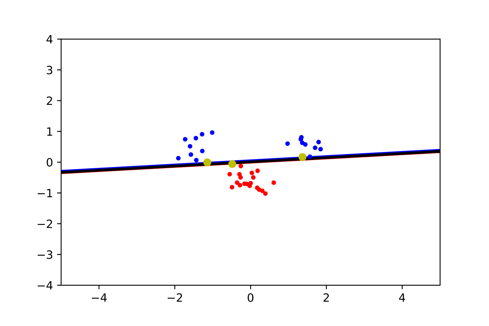
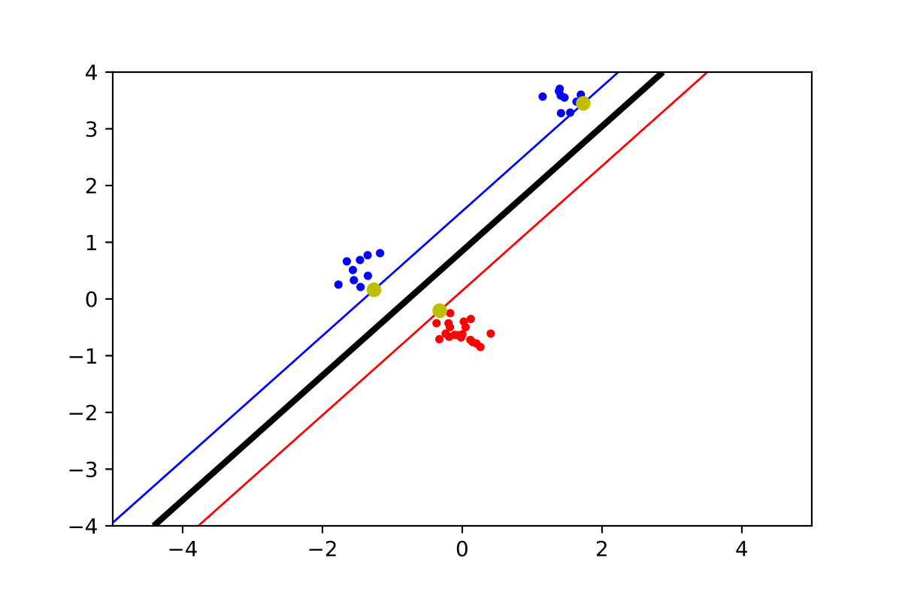
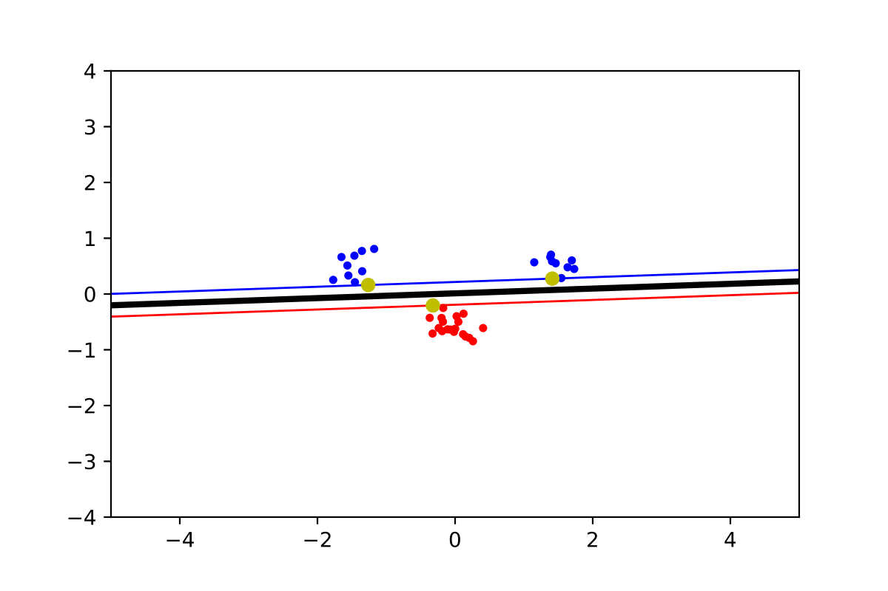
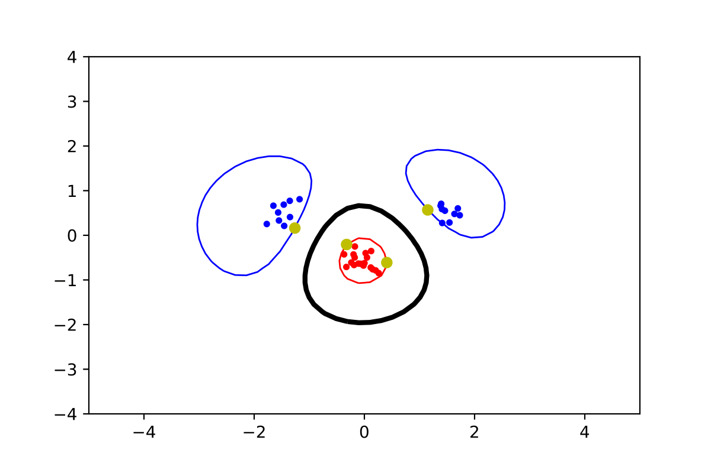

# LAB.2 - Support Vector Machines
**Authors:** Jonathan Rintala, Erik Skogetun

Answers for Laboration 2 in DD2421 Machine Learning at KTH.

---

The objective of this lab assignment is that you should get hands-on experience with implementing and using a Support Vector Machine. In particular, you should be able to:

* use the mathematical formulation of the optimization task,
* formulate the indicator function and explain how it relates to the outcome of the classification,
* predict and explain the outcome of using different kernels,
* explain the effect of the C-value when using slack variables.

---

### Move the clusters around and change their sizes to make it easier or harder for the classifier to find a decent boundary. Pay attention to when the optimizer (minimize function) is not able to find a solution at all.

Generic dataset:

Increasing the “spread”-factor to above 0.3, will result in the optimizer not being able to find a solution without slack. This is because the data cannot be separated with a straight line. This is the result when set to 0,3:

Moving one of the clusters up gave the following results:

### Implement the two non-linear kernels. You should be able to classify very hard data sets with these.

The following is a polynomial kernel with increasing p-value on the generic dataset.

GIF:

The following is an RBF-Kernel with increasing sigma-value on the generic dataset.

### The non-linear kernels have parameters; explore how they influence the decision boundary. Reason about this in terms of the bias variance trade-off.

**RBF - Sigma:**

As sigma is increased, the function smoothness increases, meaning that a very high sigma will approach a straight line. Thus, complexity of the curve decreases and with that the variance decreases as well, but the bias will be high. Depending on the data, different sigma will produce different error rates on the test data, so it will have to be adapted to each case.

**Polynomial – p:**

Similar to the RBF question, complexity will increase with a higher order regression polynomial (p). Thus, variance increases but bias decreases when p is higher. Again, the order of the polynomial must be adapted to each set of data in order to achieve the highest performing model.

### Explore the role of the slack parameter C. What happens for very large/small values?
The slack parameter represents a tolerance/’slack’ for data points which are not separable, often because those parameters are not behaving ‘as expected’ from the data points in the class, for example by being close to a group of datapoints from another class. The slack-meaning of the C-value can be considered inversely, as a high C means low slack, and low C means higher slack, i.e. more tolerance of outliers. As C decreases, higher error is allowed, meaning that the margins expand (including more vectors).

#### Imagine that you are given data that is not easily separable. When should you opt for more slack rather than going for a more complex model (kernel) and vice versa?
In low-dimension data this can be done visually. If the data points look like they should be separated by a line, but there are some outliers, it is probably more relevant to use a linear (less complex) kernel and allow for more slack. However, the more complex distribution of data points, the more relevant it is to use a more complex model. In other words, slack is mostly useful in the case of a small number of outliers which prevents the use of an otherwise well-suited model.

You should also try to keep the proportion of support vectors low, as a high number will tend to over-train the model. Slack can help with this.
