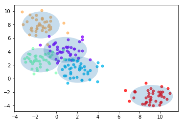
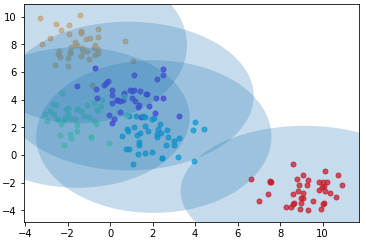
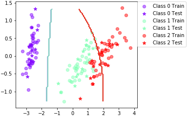
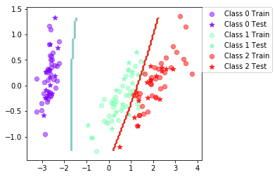

# LAB.3 - Bayesian Learning & Boosting

**Authors:** Jonathan Rintala, Erik Skogetun

Answers for Laboration 3 in DD2421 Machine Learning at KTH.

------

## Assignment 1

Firstly, we use the provided function genBlobs(), to plot the the Gaussian distributed datapoints, together with their class labels, providing a number of centers as parameters. Then we add the ML estimates, and plot it all together with the function plotGaussian().



*Figure 1.1 - centers = 5*


## Assignment 2

The following functions were completed:

- computePrior(labels)
- classifyBayes(X,prior,mu,sigma)


## Assignment 3

### Iris dataset

The following is the datapoints including blobs:



The following is the plot boundary:



Trial | Accuracy
--- | ---
0 | 84.4
10 | 86.7
20 | 88.9
30 | 86.7
40 | 86.7
50 | 91.1
60 | 88.9
70 | 93.3
80 | 86.7
90 | 88.9

*Final mean classification accuracy: 88.1*  
*Standard deviation: 4.14*

### Vowel dataset
Trial | Accuracy
--- | ---
0 | 58.4
10 | 66.9
20 | 67.5
30 | 57.8
40 | 63.6
50 | 63
60 | 64.9
70 | 62.3
80 | 59.1
90 | 70.1

*Final mean classification accuracy: 62.6*  
*Standard deviation: 3.54*

1) **When can a feature independence assumption be reasonable and when not?**
In general, it is often not realistic to think features are independent, but it may be a useful assumption in order to reduce complexity. For example, if we want to classify  book genres, we can use the words as features. The words will often indicate the genre of book, but occurence of words may also correlate to occurence of other words. However, this factor is very hard to actually mathematically implement, and the model may still be very powerful regardsless of feature dependence, so the assumption can be reasonable to make. However, it is not reasonable to made such an assumption when its probable that there is a very high dependence of features or when there is a high risk involved in a bad model.

2) **How does the decision boundary look for the Iris dataset? How could one improve the classication results for this scenario by changing classifier or, alternatively, manipulating the data?**
There are two boundaries which divide the three classes. The classes 0 and 1 are divided successfully, but the classes 1 and 2 are divided using a quite unintuitive curve. By looking at the datapoints, it should rather be divided with a straight line leaning up-right.A low-complexity SVM with some slack would probably be a good alternative of a classifier.


## Assignment 4

```python
[1] weightsum = sum(W[idx,:])
[2] featuresWeighed = X[idx,:]*W[idx,:] #get row vectors
[3] mu[jdx] += np.sum(featuresWeighed, axis=0) / weightsum
```

[2] We take each datapoint's features and multiply them with the weight for the datapoint.

[3] We look at each dimension one at a time. And for each dimension, we add up all the featuresWeighed i.e. N number of datapoints for that dimension and dataset.


## Assignment 5

```python
testClassifier(BoostClassifier(BayesClassifier(), T=10), dataset='iris',split=0.7)

   Trial: 0 Accuracy 100
   Trial: 10 Accuracy 97.8
   Trial: 20 Accuracy 93.3
   Trial: 30 Accuracy 93.3
   Trial: 40 Accuracy 97.8
   Trial: 50 Accuracy 86.7
   Trial: 60 Accuracy 93.3
   Trial: 70 Accuracy 95.6
   Trial: 80 Accuracy 93.3
   Trial: 90 Accuracy 95.6
  
Final mean classification accuracy  94.2 with standard deviation 6.83
```

```python
testClassifier(BoostClassifier(BayesClassifier(), T=10), dataset='vowel',split=0.7)

    Trial: 0 Accuracy 68.8
    Trial: 10 Accuracy 77.9
    Trial: 20 Accuracy 77.3
    Trial: 30 Accuracy 70.1
    Trial: 40 Accuracy 68.8
    Trial: 50 Accuracy 68.2
    Trial: 60 Accuracy 77.3
    Trial: 70 Accuracy 70.8
    Trial: 80 Accuracy 71.4
    Trial: 90 Accuracy 82.5
	
Final mean classification accuracy  74.1 with standard deviation 3.73
```



1) Is there any improvement in classication accuracy? Why/why not?

 &nbsp;| Iris | Vowel
--- | --- | ---
**Previously** | 89,2 |  61,3
**Now** | 94,2 | 74,1
**Difference** | 5 | 12,8

This means both datasets have had quite significant improvements. This is due to the weights being adapted in order to represent their importance for the classification.

2) Plot the decision boundary of the boosted classier on iris and compare it with
that of the basic. What differences do you notice? Is the boundary of the boosted
version more complex?

The boundaries seem less complex, almost linear. The boundary between class 1 and 2 especially has become less complex, which in this case divides the classes more successfully. However, in theory, adaboost should increase complexity by focusing on missclassified points, rather than all the same.

3) Can we make up for not using a more advanced model in the basic classier
(e.g. independent features) by using boosting?

Yes, boosting will act as a more complex model. However, boosting can also reduce both bias and variance, but can tend to overfit if overused.


## Assignment 6

See code.


## Assignment 7 - Which Classifier?

**If you had to pick a classifier, naive Bayes or a decision tree or the boosted versions of these, which one would you pick? Motivate from the following criteria:** 


- **Outliers:**

  - NB, no boosting
  - Boosted classifiers will give higher weights to outliers, in order to focus on them in the learning process, to minimize the error rate => risk of assigning too much weight to outliers
  - Boosted DT performed better than boosted NB, between those would choose DT
  - Risk with DT is the tendency to overfit


- **Irrelevant input:**

  - DT
  - In decision trees, the pruning process gets rid of most irrelevant input => should be preferred choice
  - Decision trees - could be built upon information gain => order different questions in terms of how much information they give
  - Thus, features that are irrelevant will be placed further down in the tree structure => affecting the results less
  - Boosting only affects the weights for the datapoints


- **Predictive power:**

  - NB, boosting
  - The accuracy score acquired for the boosted vs. non-boosted classifiers, indicated that boosted classifiers performed better
  - Decision trees also had higher accuracy measure than Naive Bayes, but it seems to be dependent upon choice of dataset as well.


- **Mixed types of data (ex. binary, categorial or continuous features):**

  - NB can handle continuous data input slightly better than decision trees 
  - However, both NB and DT can handle a mix of data of continuous and categorial nature


- **Scalability:** 

  - DT
  - When dimension of data and/or number of instances is large
  - “Curse of dimensionality” - one way to deal with it is to assume all features and independent of one another - Naive Bayes assumption
  - Matrices are difficult to calculate as they grow in size, same with huge trees
  - However, trees seem a bit more effective for larger datasets